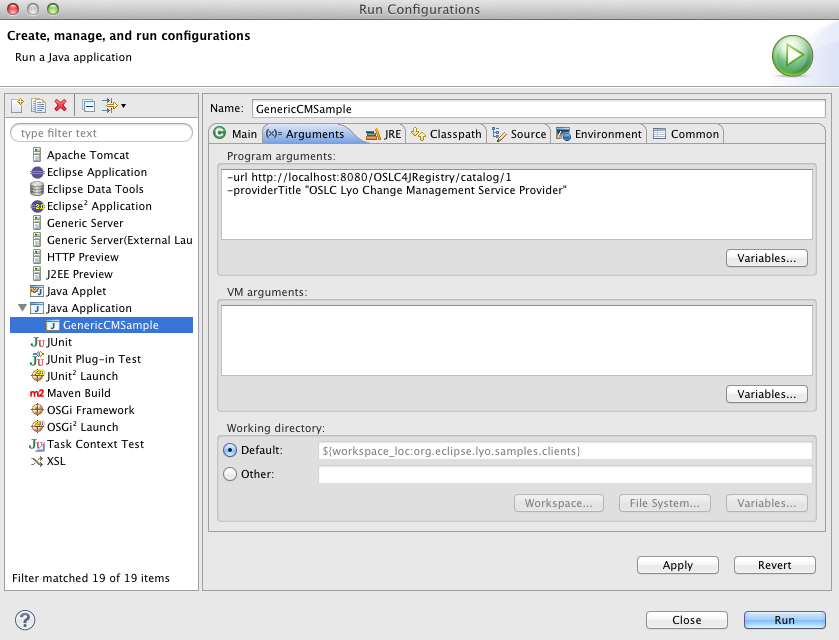
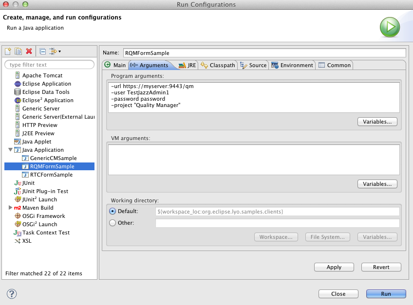
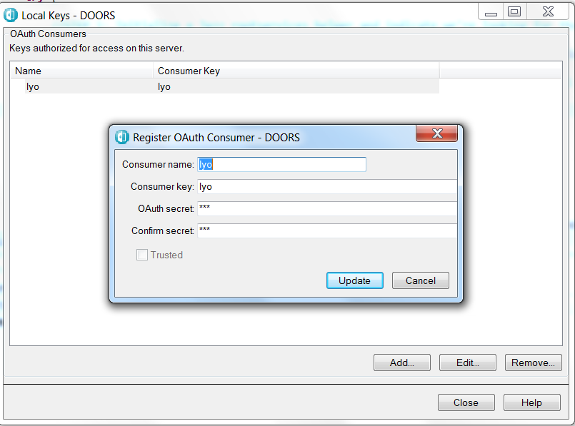
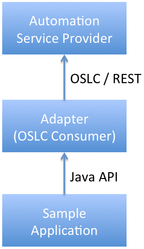

# Eclise Lyo Client - Sample Code

This is a repository of sample code for the [OSLC](https://open-services.net/) [Lyo Client](https://oslc.github.io/developing-oslc-applications/eclipse_lyo/eclipse-lyo.html).

Lyo Client is an SDK that provides helpful APIs to interact with OSLC Servers. It provides an additional layer of functionality on top of Apache HttpClient, Apache Wink, and OSLC4J that can give you a head start on some of the common use cases such as form login, OAuth handling, service discovery, sending queries, and processing query results.

You can find more resources for developing OSLC applications with Lyo, under the [OSLC Developer Guide](http://oslc.github.io/developing-oslc-applications/eclipse_lyo/eclipse-lyo.html).

You are also welcome to contact the development team via [lyo-dev mailing list](https://dev.eclipse.org/mailman/listinfo/lyo-dev)

> **Please note:** Most of code in this repo is not always up to date. You are welcome to [contribute](https://github.com/eclipse/lyo#contributing) fixes and suggestions.

# Selected Project Descriptions

Below is a selected subset of projects in this repository. 

The latest samplest target the Lyo release 4.0.0, which supports JAX-RS 2.0, and no longer depend on any particlar implementation of JAX-RS. This gives the developer the chance to adopt any preferred implementation such as [Jersey](https://jersey.github.io/), [RESTEasy](https://resteasy.github.io/), etc.

Earlier samples targetting Lyo 2.4.0 (and earlier) supports JAX-RS 1.0, and assumes the [Apache Wink implementation](https://svn.apache.org/repos/infra/websites/production/wink/content/index.html).

## [OSLC Client Authentication, Service Discovery & Delegated UIs](https://github.com/OSLC/lyo-samples/tree/master/client-oauth-discovery-dui) - Sample code for Lyo 4.0.0 (JAX-RS 2.0)

This OSLC client application 
* Explores the different client authentication alternatives of (1) oauth (2) basic authentication (3) no authentication.
* Demonstrates how to discover OSLC services.
* Demonstrates how to integrate Delegated-UI iframes into your own web-based application.

To run the adaptor as a regular web application, run:

    mvn clean jetty:run-exploded

You can then explore the server starting with http://localhost:8081/discovery/services/discovery. 

## [oslc4j-client-samples](https://github.com/OSLC/lyo-samples/tree/master/oslc4j-client-samples) - Sample code for Lyo 4.0.0 (JAX-RS 2.0)
This is a subset of the sample code from Lyo 2.4.0 detailed under [oslc-java-samples](https://github.com/OSLC/lyo-samples#oslc-java-samples).

## [oslc-java-samples](https://github.com/OSLC/lyo-samples/tree/master/oslc-java-samples) - Sample code for Lyo 2.4.0 (JAX-RS 1.0)
This project contains a set of simple stand-alone java applications. 

### [GenericCMSample](https://github.com/OSLC/lyo-samples/blob/master/oslc-java-samples/src/main/java/org/eclipse/lyo/client/oslc/samples/GenericCMSample.java)

This sample demonstrates how to use the Lyo client to interact with a
Change Management (CM) Service Provider in the following ways:

-   run an OLSC ChangeRequest query and retrieve OSLC ChangeRequests and
    de-serialize them as Java objects
-   retrieve an OSLC ChangeRequest and print it as XML
-   create a new ChangeRequest
-   update an existing ChangeRequest

To run the sample you first need to follow the instructions to build and
run the [ Change Management Reference
Implementation](Lyo/BuildingOSLC4J "wikilink"). Then you can create a
launch configuration in eclipse to run GenericCMSample as a java
application.

-   Go to the *org.eclipse.lyo.samples.clients* project and follow the
    src/main/java directory
-   Open up the *org.eclipse.lyo.client.oslc.samples* package
-   Right-click on the GenericCMSample.java program, and select **Run As
    -\> Run Configurations**.
-   Pass in the following values for the command line arguments as shown
    below:

### [RQMFormSample](https://github.com/OSLC/lyo-samples/blob/master/oslc-java-samples/src/main/java/org/eclipse/lyo/client/oslc/samples/RQMFormSample.java)

This sample demonstrates how to use the Lyo client to interact with a
Quality Management (QM) Service Provider in the following ways:

-   run an OLSC TestResult query and retrieve OSLC TestResults and
    de-serialize them as Java objects
-   retrieve an OSLC TestResult and print it as XML
-   create a new TestCase
-   update an existing TestCase

To run this sample you can install and configure a Quality Management V2
service provider such as Rational Quality Manager. Then create a launch
configuration in eclipse to run RQMFormSample as a java application,
passing in values for the command line arguments as shown below:

### [RTCFormSample](https://github.com/OSLC/lyo-samples/blob/master/oslc-java-samples/src/main/java/org/eclipse/lyo/client/oslc/samples/RTCFormSample.java)

This sample demonstrates how to use the Lyo client to interact with a
Change Management (CM) Service Provider in the following ways:

-   run an OLSC ChangeRequest query and retrieve OSLC ChangeRequests and
    de-serialize them as Java objects
-   retrieve an OSLC ChangeRequest and print it as XML
-   create a new ChangeRequest
-   update an existing ChangeRequest

To run this sample you can install and configure a Change Management V2
service provider such as Rational Team Concert. Then create a launch
configuration in eclipse to run RTCFormSample as a java application,
passing in values for the command line arguments as shown below:

### [DoorsOauthSample](https://github.com/OSLC/lyo-samples/blob/master/oslc-java-samples/src/main/java/org/eclipse/lyo/client/oslc/samples/DoorsOauthSample.java)

This sample demonstrates how to use the Lyo client to interact with IBM
Rational DOORS in the following ways:

-   Connects to IBM Rational DOORS using OAuth
-   Creates a requirement in DOORS
-   Updates a requirement in DOORS (hardcoded to update one with id 1)

The update has an outstanding issue with dates leading to WARNINGs, but
it does work in the latest version. In older versions of the sample this
would result in ERRORs. Do a git pull if you are seeing errors regarding
dates (not warnings).

It requires DOORS Web Access 9.5.0 or later. Ideally 9.5.1.2+.

In DOORS go to File-OSLC-Local Keys (or Database Properties-Local Keys
in 9.5.0.x). Add a new OAuth Consumer by giving a name, key and secret.
Note the key and secret used.

Edit the DoorsOauthSample.java. Locate this section and replace the
consumer key and secret with what was registered with DOORS:

//STEP 2: Create a new OSLC OAuth capable client, the parameter of
following call should be provided // by the system administrator of the
DOORS Web Access server e.g

OslcOAuthClient client = helper.initOAuthClient(\"lyo\", \"lyo\");

Right click and select Run As - Run Configuration. Under Arguments add
the connection details for your DOORS Web Access and a module name. e.g.

-url <https://example.com:9443/dwa> -user <user> -password <password>
-project \"my DOORS Module\"

Run it by right click Run As - Java Application.

### [RQMAutomationSample](https://github.com/OSLC/lyo-samples/blob/master/oslc-java-samples/src/main/java/org/eclipse/lyo/client/oslc/samples/RQMFormSample.java)

This sample demonstrates how to use the Lyo client to interact with an
Automation Service Provider. It provides an Automation Adapter resource
which can be used to communicate with the Automation Provider for
activities such as polling for Automation Requests. It also provides a
sample application that demonstrates how to initialize the Automation
Adapter and register it with the Automation Provider.

When an Automation Request becomes available the Automation Adapter
takes ownership of the request and gives control back to the sample
application for execution of a test script. While the test automation is
underway the sample application uses the Automation Adapter to send
progress updates to the Automation Service Provider. When the test
automation has completed the sample application uses the Automation
Adapter to upload an attachment to the Service Provider and send an
Automation Result back to the Automation Provider.

To run this sample you can install and configure a Automation Service
Provider such as Rational Quality Manager. Then update the
adapter.properties file with the information about your Adapter client
and the Automation Provider.

Finally, to run the Sample application right click
RQMAutomationSample.java in your Explorer view and select Run As-\>Java
Application.

## [Two-legged OAuth Sample](https://github.com/OSLC/lyo-samples/tree/master/oauth-cli-helper)

This is a simple example of how to sign requests using two-legged OAuth
in Java. You\'ll need to set up an OAuth consumer on the server you want
to connect to. If using CLM, you\'ll want to set up an OAuth Consumer
with a functional user.

-   Edit
    org.eclipse.lyo.client.java.oauth.sample/src/main/resources/oauth.properties
    and set your consumer key and secret.
-   Run these commands to try the sample:

<!-- -->

    $ cd org.eclipse.lyo.client.java.oauth.sample
    $ mvn install
    $ mvn exec:java -Dexec.mainClass="org.eclipse.lyo.client.oauth.sample.OAuthClient" -Dexec.args="<uri_to_connect_to>"

Two-legged OAuth does not require an access token or a user to type in a
password. You simply need the consumer key and consumer secret to sign
the requests. Performing two-legged OAuth is generally preferable to
storing a username and password on the client, although you should treat
the consumer secret like it\'s a password.

## License

This program and the accompanying materials are made available under the terms of the Eclipse Public License v1.0 and Eclipse Distribution License v. 1.0 which accompanies this distribution ([LICENSE](LICENSE) and [LICENSE.EPL](LICENSE.EPL)).

