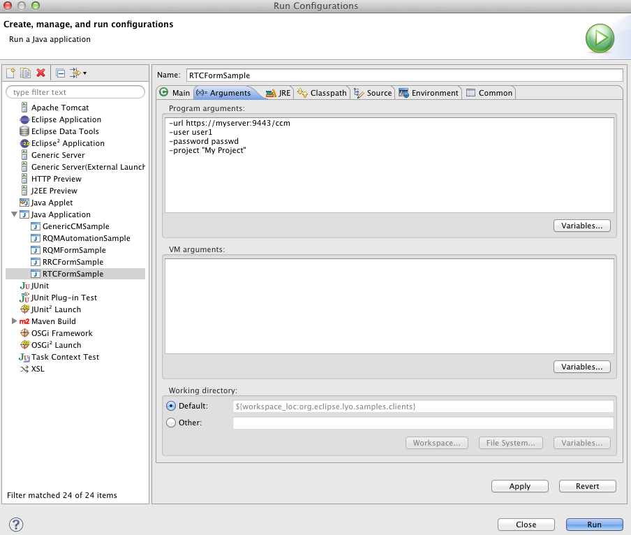
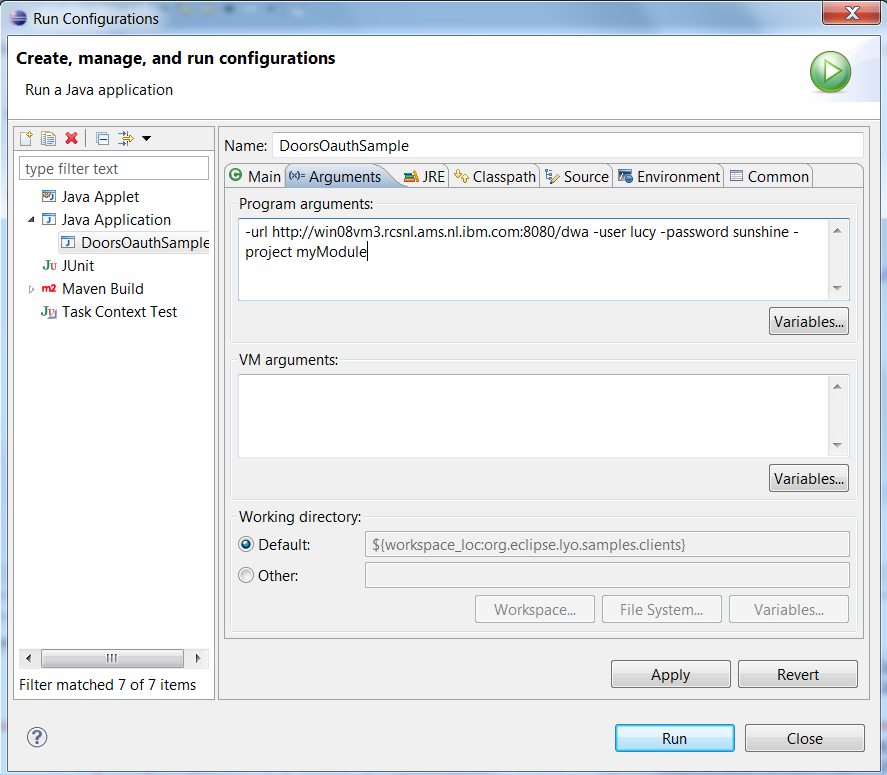
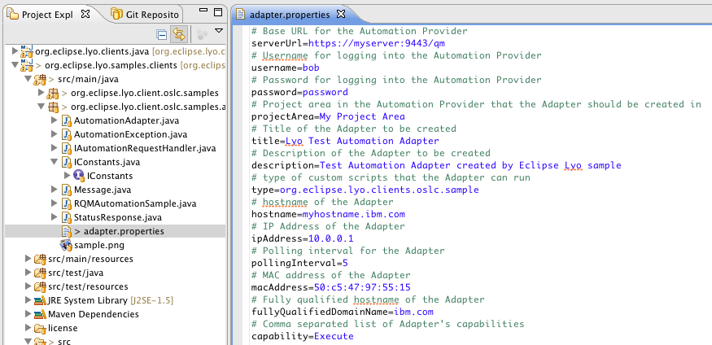

## Sample code for OSLC4J Client (aka Wink client aka legacy client)

This is a repository of sample code for the [OSLC](https://open-services.net/) [Lyo Client](https://oslc.github.io/developing-oslc-applications/eclipse_lyo/eclipse-lyo.html). This project contains a set of simple stand-alone java applications.

> Should work on Lyo versions 2.1.2-2.4.0 and potentially 4.0.0 and 4.1.0.

Lyo Client is an SDK that provides helpful APIs to interact with OSLC Servers. It provides an additional layer of functionality on top of Apache HttpClient, Apache Wink, and OSLC4J that can give you a head start on some of the common use cases such as form login, OAuth handling, service discovery, sending queries, and processing query results.

### [GenericCMSample](src/main/java/org/eclipse/lyo/client/oslc/samples/GenericCMSample.java)

This sample demonstrates how to use the Lyo client to interact with a
Change Management (CM) Service Provider in the following ways:

- run an OLSC ChangeRequest query and retrieve OSLC ChangeRequests and
  de-serialize them as Java objects
- retrieve an OSLC ChangeRequest and print it as XML
- create a new ChangeRequest
- update an existing ChangeRequest

To run the sample you first need to follow the instructions to build and
run the [ Change Management Reference
Implementation](Lyo/BuildingOSLC4J "wikilink"). Then you can create a
launch configuration in eclipse to run GenericCMSample as a java
application.

- Go to the _org.eclipse.lyo.samples.clients_ project and follow the
  src/main/java directory
- Open up the _org.eclipse.lyo.client.oslc.samples_ package
- Right-click on the GenericCMSample.java program, and select **Run As
  -\> Run Configurations**.
- Pass in the following values for the command line arguments as shown
  below:

### [RQMFormSample](src/main/java/org/eclipse/lyo/client/oslc/samples/RQMFormSample.java)

This sample demonstrates how to use the Lyo client to interact with a
Quality Management (QM) Service Provider in the following ways:

- run an OLSC TestResult query and retrieve OSLC TestResults and
  de-serialize them as Java objects
- retrieve an OSLC TestResult and print it as XML
- create a new TestCase
- update an existing TestCase

To run this sample you can install and configure a Quality Management V2
service provider such as Rational Quality Manager. Then create a launch
configuration in eclipse to run RQMFormSample as a java application,
passing in values for the command line arguments as shown below:

### [RTCFormSample](src/main/java/org/eclipse/lyo/client/oslc/samples/RTCFormSample.java)

This sample demonstrates how to use the Lyo client to interact with a
Change Management (CM) Service Provider in the following ways:

- run an OLSC ChangeRequest query and retrieve OSLC ChangeRequests and
  de-serialize them as Java objects
- retrieve an OSLC ChangeRequest and print it as XML
- create a new ChangeRequest
- update an existing ChangeRequest

To run this sample you can install and configure a Change Management V2
service provider such as Rational Team Concert. Then create a launch
configuration in eclipse to run RTCFormSample as a java application,
passing in values for the command line arguments as shown below:

### [DoorsOauthSample](src/main/java/org/eclipse/lyo/client/oslc/samples/DoorsOauthSample.java)

This sample demonstrates how to use the Lyo client to interact with IBM
Rational DOORS in the following ways:

- Connects to IBM Rational DOORS using OAuth
- Creates a requirement in DOORS
- Updates a requirement in DOORS (hardcoded to update one with id 1)

The update has an outstanding issue with dates leading to WARNINGs, but
it does work in the latest version. In older versions of the sample this
would result in ERRORs. Do a git pull if you are seeing errors regarding
dates (not warnings).

It requires DOORS Web Access 9.5.0 or later. Ideally 9.5.1.2+.

In DOORS go to File-OSLC-Local Keys (or Database Properties-Local Keys
in 9.5.0.x). Add a new OAuth Consumer by giving a name, key and secret.
Note the key and secret used.

Edit the DoorsOauthSample.java. Locate this section and replace the
consumer key and secret with what was registered with DOORS:

//STEP 2: Create a new OSLC OAuth capable client, the parameter of
following call should be provided // by the system administrator of the
DOORS Web Access server e.g

OslcOAuthClient client = helper.initOAuthClient(\"lyo\", \"lyo\");

Right click and select Run As - Run Configuration. Under Arguments add
the connection details for your DOORS Web Access and a module name. e.g.

-url <https://example.com:9443/dwa> -user <user> -password <password>
-project \"my DOORS Module\"

Run it by right click Run As - Java Application.

### [RQMAutomationSample](src/main/java/org/eclipse/lyo/client/oslc/samples/RQMFormSample.java)

This sample demonstrates how to use the Lyo client to interact with an
Automation Service Provider. It provides an Automation Adapter resource
which can be used to communicate with the Automation Provider for
activities such as polling for Automation Requests. It also provides a
sample application that demonstrates how to initialize the Automation
Adapter and register it with the Automation Provider.

When an Automation Request becomes available the Automation Adapter
takes ownership of the request and gives control back to the sample
application for execution of a test script. While the test automation is
underway the sample application uses the Automation Adapter to send
progress updates to the Automation Service Provider. When the test
automation has completed the sample application uses the Automation
Adapter to upload an attachment to the Service Provider and send an
Automation Result back to the Automation Provider.

To run this sample you can install and configure a Automation Service
Provider such as Rational Quality Manager. Then update the
adapter.properties file with the information about your Adapter client
and the Automation Provider.

Finally, to run the Sample application right click
RQMAutomationSample.java in your Explorer view and select Run As-\>Java
Application.
